# MedLens

AI-powered medication reconciliation for clinical documentation: extracts structured medication data from clinical notes and finds discrepancies between them using a deterministic comparison engine.

MedLens reads synthetic clinical documents (visit notes, discharge summaries, medication lists), extracts structured medication information with an LLM, and compares it against a patient's medication list to surface documentation inconsistencies, each finding backed by the specific evidence that produced it. It's a full-stack, production-style application: FastAPI + PostgreSQL backend, React + TypeScript frontend, Docker Compose deployment with HTTPS on AWS EC2, and a real automated test suite on both sides.

[](https://github.com/built-by-ann/medlens/actions/workflows/backend.yml)
[](https://github.com/built-by-ann/medlens/actions/workflows/frontend.yml)
[](LICENSE)


**[Live demo: medlenshealth.com](http://medlenshealth.com)**

**Status:** Active development (Sprint 4 - production engineering)

> MedLens uses synthetic clinical data only. It is an educational software engineering portfolio project: it is not HIPAA compliant, does not provide medical advice, and is not intended for clinical use.

---

## Screenshots

**Dashboard** - recent patients and the cross-patient Recent Analyses feed.

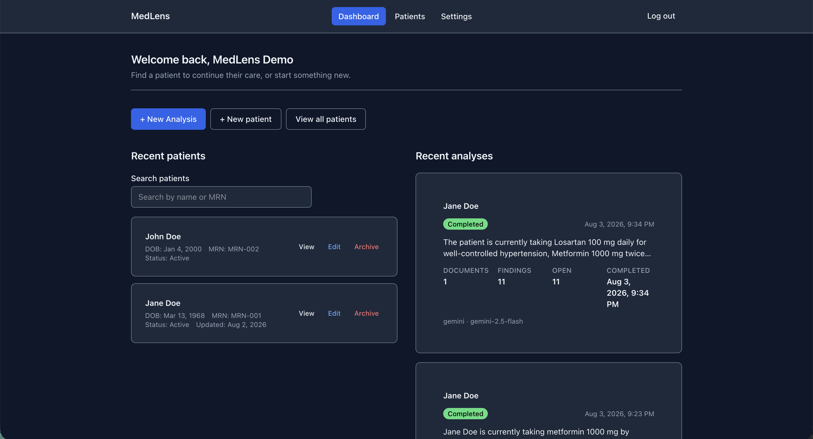

**Patient overview** - identity details, quick actions, and recent clinical documents for one patient.

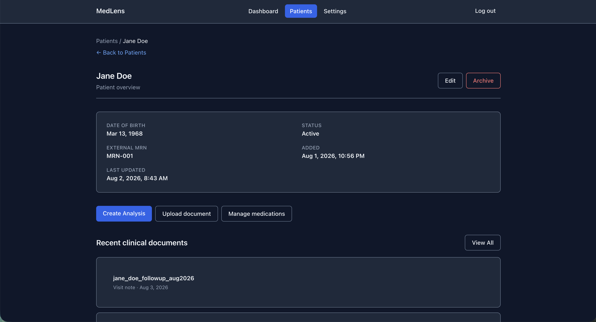

**Medication list** - a patient's current medications, searchable, with edit/delete.

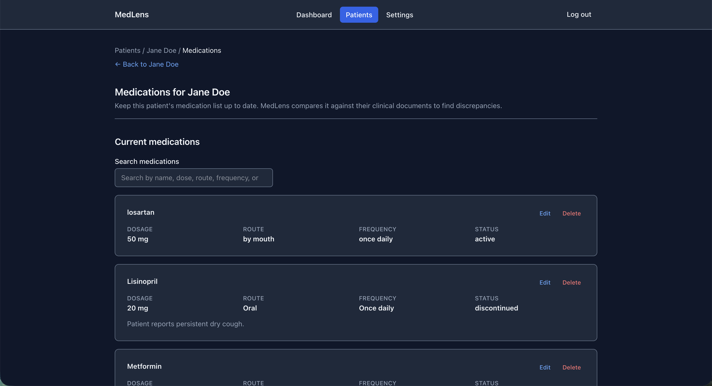

**CSV import** - importing a medication list from a CSV file, alongside the manual add-medication form.

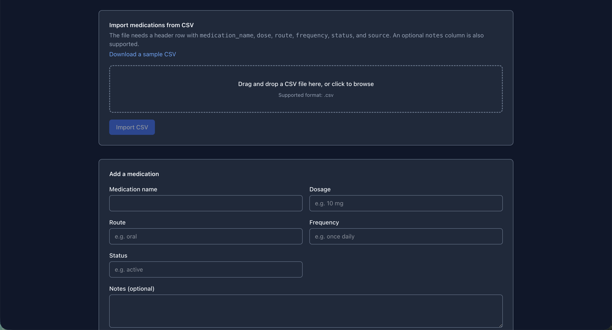

**Create Analysis** - selecting existing documents and uploading new ones into the same analysis.

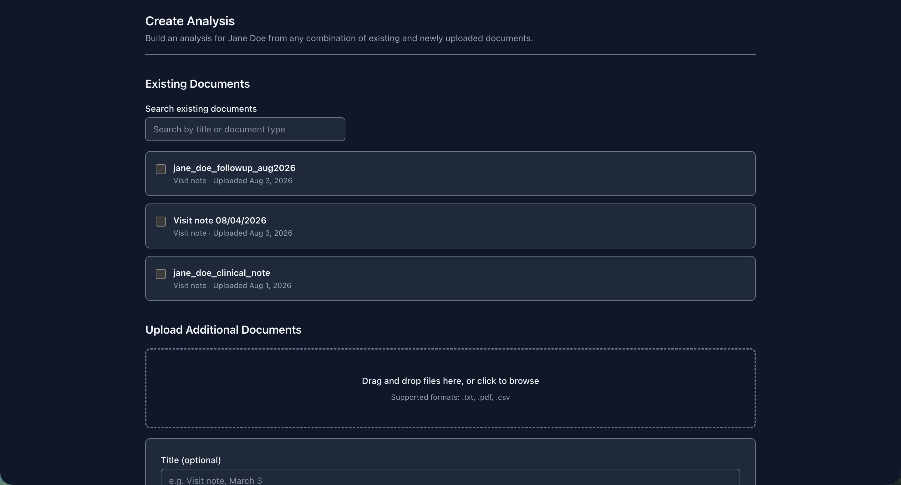

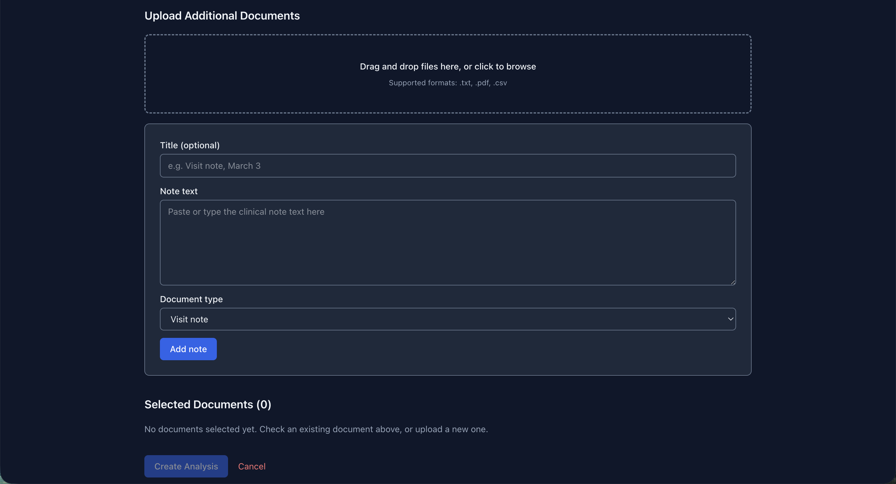

**Reconciliation findings** - discrepancies grouped by severity, each with supporting evidence and resolution actions.

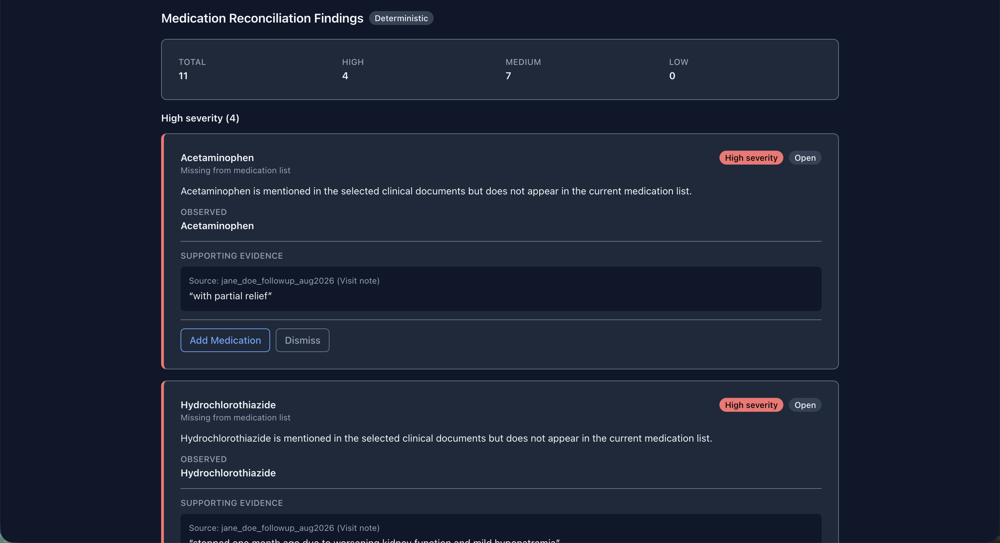

**AI summary** - the extracted, structured medication data behind a completed analysis.

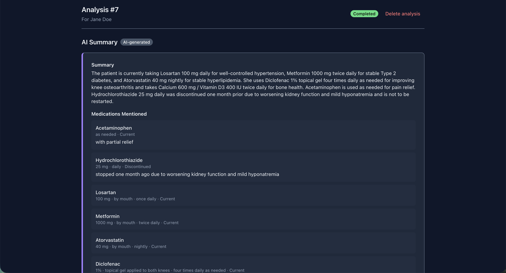

**Login**

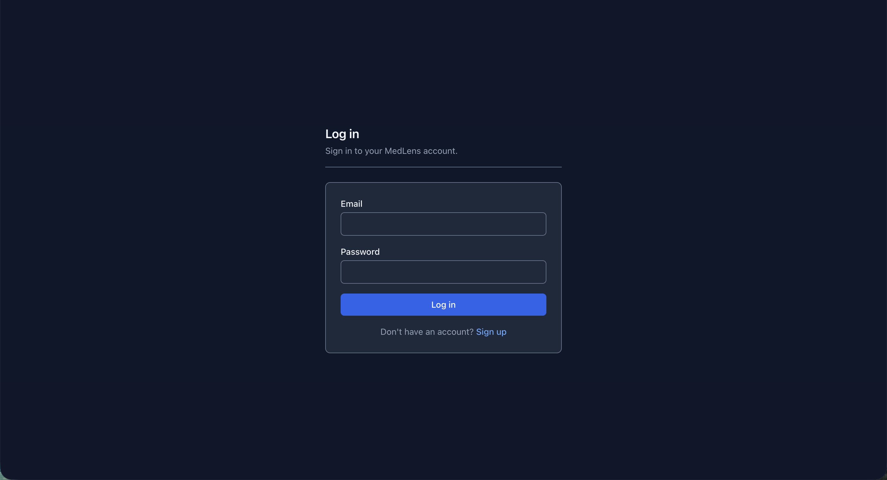

**Responsive mobile layout**

<table>
  <tr>
    <td>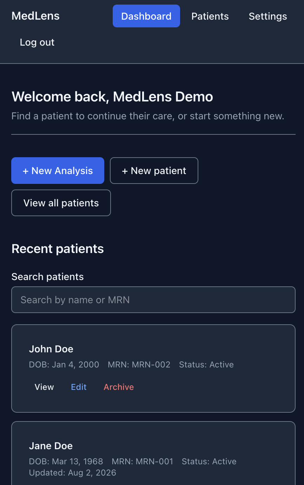</td>
    <td>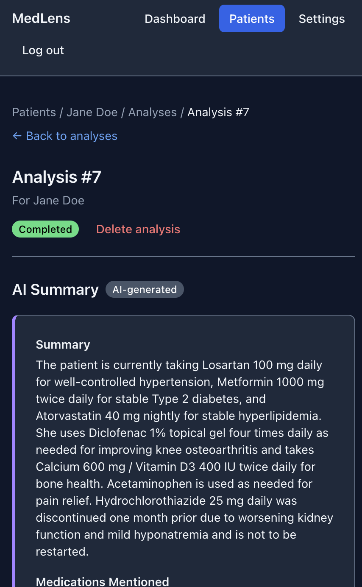</td>
    <td>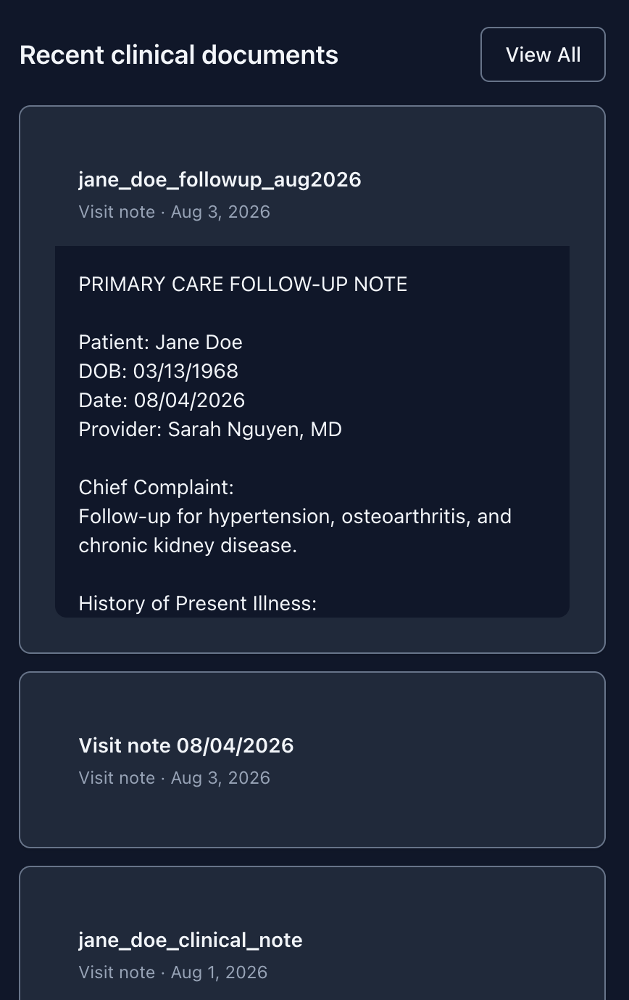</td>
  </tr>
</table>

---

## Features

**Patients and clinical documentation.** Provider-managed patient charts; clinical documents added by pasting text or uploading TXT, PDF, or CSV files, stored via a pluggable backend (local disk or Amazon S3).

**AI-powered extraction.** Google Gemini reads each document and extracts structured medication mentions (name, dose, route, frequency, status) plus a narrative summary, validated against a strict schema before anything is persisted.

**Deterministic reconciliation.** A separate, non-AI comparison engine checks the AI-extracted mentions against the patient's own medication list and produces evidence-backed discrepancies - no fuzzy matching, no hallucination risk in the comparison itself.

**Discrepancy resolution workflow.** Each finding can be accepted (creating or updating the medication list), dismissed, or left open, with a full audit trail of who resolved it, when, and why.

**Authentication and account management.** JWT-based auth, unique usernames, and profile/appearance/accessibility settings, including 27 selectable color themes.

---

## Why MedLens?

Medication information is often scattered across a patient's chart - a visit note, a discharge summary, a medication list - and these sources can quietly drift out of sync. MedLens was inspired by research at Vanderbilt University Medical Center on medication documentation inconsistencies within electronic health records: the same problem, explored as a portfolio-scale engineering project rather than a research artifact.

The core idea is a deliberate split of responsibility. AI is good at reading unstructured text and pulling out structured facts, so that's all it's asked to do. Deciding whether two structured facts actually conflict is a comparison problem, not a language problem - handled by explicit, deterministic backend logic that's reproducible and unit-testable, with no risk of an LLM silently merging two different medications or inventing an equivalence that isn't there.

**How it works, end to end:**

1. Register and authenticate (JWT).
2. Add a patient and upload or paste one or more clinical documents.
3. Gemini extracts structured medication data from each document.
4. A deterministic reconciliation engine compares that data against the patient's medication list.
5. Discrepancies are surfaced with the exact evidence (source document, quoted text) behind each one.
6. A provider reviews each finding and resolves, dismisses, or updates the medication list accordingly.

---

## Architecture Overview

```text
Browser
   │
   ▼
nginx (single public entry point, HTTPS)
   ├─ serves the React SPA
   └─ reverse-proxies /api/* ──▶ FastAPI backend
                                       │
                         ┌─────────────┼─────────────┐
                         ▼             ▼             ▼
                    PostgreSQL     Gemini API    Storage (local or S3)
                                                       │
                                                       ▼
                                     Deterministic Reconciliation Engine
                                        (no AI - plain Python logic)
```

A layered FastAPI backend (routers → services → models/schemas) serves a React SPA, both coordinated by the same Docker Compose file in local development and production. See [docs/architecture.md](docs/architecture.md) for component interaction, request flows, and the full set of architectural principles.

---

## AI Pipeline

Gemini, behind a swappable `AIProvider` interface, reads clinical note text and returns structured JSON: extracted medications and a short summary. Every response is validated against a strict Pydantic schema (`extra="forbid"`) before it's trusted - a malformed or unexpected response fails the request rather than being silently accepted.

That's the entire scope of what AI does here. It never compares documents, decides whether two records conflict, or makes a clinical decision - that boundary is enforced structurally, not just by convention: the reconciliation engine's own code has no dependency on the AI layer at all. See [docs/ai.md](docs/ai.md) for the provider abstraction, prompt design, structured output validation, and the full AI/deterministic boundary.

---

## Technology Stack

**Frontend**
React · TypeScript (strict) · Vite · React Router · Axios · Tailwind CSS v4

**Backend**
FastAPI · Python 3.12 · SQLAlchemy · Alembic · Pydantic · JWT authentication

**Database**
PostgreSQL

**AI**
Google Gemini (default) and OpenBioLLM (`aaditya/Llama3-OpenBioLLM-8B`, via Hugging Face's hosted Inference Providers), selectable behind a provider-abstraction layer - MedGemma and multi-model benchmarking planned

**Infrastructure**
Docker · Docker Compose · nginx (reverse proxy, TLS termination) · Let's Encrypt / Certbot · AWS EC2 · AWS S3 (optional storage backend) · GitHub Actions

**Testing**
pytest against a real, isolated PostgreSQL database (537 backend tests) · Vitest + React Testing Library (~600 frontend tests) · moto (mocked AWS S3)

**Developer Tools**
Ruff (lint + format) · ESLint (flat config, typescript-eslint) · Prettier · TypeScript strict mode · actionlint

---

## Technical Highlights

- **Provider and storage abstraction** - AI providers and file storage backends (local disk / S3) are both selected behind the same interface-plus-factory pattern, so swapping either is a configuration change, not a code change.
- **Deterministic reconciliation** - the one place a wrong answer would matter most is deliberately not left to a language model; it's explicit, reproducible, unit-tested Python logic.
- **Structured logging with a field allowlist** - every log record is rendered through a fixed allowlist of field names; a credential or clinical-text field can't reach a log line even if a future call site mistakenly tries to pass one.
- **Timing metrics** on nested request spans (AI call, reconciliation, full request) via `duration_ms`, correlated by request id.
- **JWT authentication with ownership-based authorization** - no roles, no server-side session store; a resource that exists but isn't yours 404s, never 403s, so the API can't be used to enumerate other users' data.
- **Multi-stage, non-root Docker images** with BuildKit cache mounts and GitHub Actions cache for fast, reproducible builds.
- **HTTPS by default** - a self-signed certificate bootstraps immediately on `docker compose up`, replaced by a real Let's Encrypt certificate via an on-demand Certbot service once DNS is configured.
- **Private-only S3 integration** - uploaded files are never made public, credentials come from an IAM role in production, and no endpoint ever returns a bucket URL.
- **Comprehensive, real-dependency testing** - both suites exercise real infrastructure (a real Postgres database, real rendered components) rather than mocking through the layer actually being tested.

---

## Repository Structure

```text
medlens/
├── backend/     FastAPI application - routes, services, models, schemas, AI layer, storage layer
├── frontend/    React + TypeScript single-page application
├── infra/       Docker Compose, nginx config, environment templates
├── docs/        Architecture, API, AI, frontend, testing, deployment, and design documentation
├── README.md
└── LICENSE
```

---

## Quick Start

```bash
git clone https://github.com/built-by-ann/medlens.git
cd medlens

# Backend + database (also builds a production frontend image for validation)
cd infra
docker compose up --build
```

For active frontend development with hot reload:

```bash
cd frontend
cp .env.example .env
npm install
npm run dev
```

Run the backend test suite:

```bash
cd backend
source .venv/bin/activate
python -m pytest -v
```

For production deployment (AWS EC2, HTTPS/TLS, S3, monitoring) see [docs/deployment.md](docs/deployment.md).

---

## Documentation

| Document | Description |
|---|---|
| [Product Requirements](docs/PRD.md) | The original problem statement, goals, and scope |
| [Architecture](docs/architecture.md) | How the frontend, backend, database, and AI layer fit together |
| [AI Architecture](docs/ai.md) | Provider abstraction, prompts, structured output, and the AI/deterministic boundary |
| [API Reference](docs/api.md) | Every endpoint, request/response schema, and error format |
| [Frontend](docs/frontend.md) | Routing, component organization, state management, and conventions |
| [Data Model](docs/data-model.md) | Entities, relationships, and schema reasoning |
| [Testing](docs/testing.md) | Testing philosophy, organization, and how to run and add tests |
| [Deployment](docs/deployment.md) | Infrastructure, Docker, nginx, HTTPS, S3, and operations |
| [Design Decisions](docs/design-decisions.md) | Why major architectural choices were made, with trade-offs |
| [Roadmap](docs/roadmap.md) | Sprint-by-sprint development milestones |

---

## Demo

MedLens is live at [medlenshealth.com](http://medlenshealth.com) (also linked at the top of this README).

<!-- TODO: Add a short walkthrough video once one is available. -->

---

## Future Improvements

- MedGemma as an additional provider, and multi-model benchmarking/evaluation against the synthetic benchmark dataset (OpenBioLLM is implemented as a selectable provider; it has not yet been benchmarked)
- Production monitoring and alerting (e.g. CloudWatch, Sentry, performance dashboards)
- A custom domain actually resolving to the production instance (HTTPS and the reverse proxy are already implemented)
- Automated, CI-triggered deployment
- FHIR and RxNorm integration
- Medication timeline visualization
- Background job processing
- PDF/CSV export and prompt versioning

See [docs/roadmap.md](docs/roadmap.md) for the full sprint-by-sprint breakdown.

---

## Design Principles

- **Modularity** - routers, services, models, and schemas each have one job; a new resource gets its own router, service, and schema rather than being folded into an existing one.
- **Explicit validation** - every request body is validated by Pydantic before a route handler runs; every AI response is validated against a strict schema before it's trusted.
- **Deterministic business logic** - medication reconciliation is explicit, testable, non-AI logic, kept that way on purpose.
- **Provider abstractions** - external dependencies (an AI provider, a storage backend) are reached through an interface, never a concrete implementation, so swapping one is a configuration change.
- **Testability** - every external dependency is reached through a seam a test can substitute with a fake, with no live network call anywhere in either test suite.

---

## License

This project is licensed under the MIT License.
