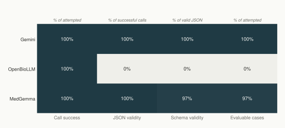
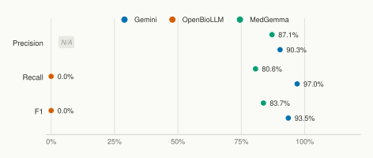
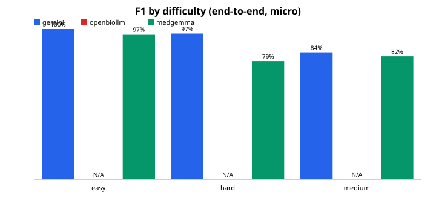
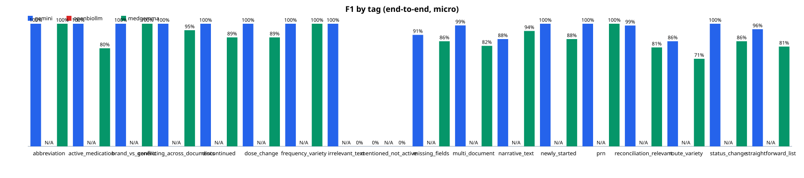
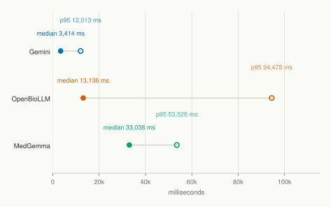

# MedLens Model Evaluation Report

Generated: 2026-09-01T21:13:45Z

See `docs/model-evaluation.md` for the full evaluation methodology this report's numbers were produced under; this document is the reviewed, promoted results of one comparison run, regenerated periodically from `benchmark/report/`, not the methodology itself.

---

## Provenance

Generated by: `python -m benchmark.report --provider gemini=20260901-173743-249636 --provider openbiollm=20260901-170758-31889a --provider medgemma=20260901-170758-31889a --output benchmark/report/output/three-model-comparison`

| Provider | Source run | Model | Backend | Runtime | Git commit | Fingerprint |
| --- | --- | --- | --- | --- | --- | --- |
| gemini | 20260901-173743-249636 | gemini-2.5-flash | - | - | c215963 | sha256:d7d23f85504a2aa1… |
| openbiollm | 20260901-170758-31889a | openbiollm-llama3-instruct | ollama | 0.33.2 | c215963 | sha256:d7d23f85504a2aa1… |
| medgemma | 20260901-170758-31889a | hf.co/bartowski/google_medgemma-4b-it-GGUF:Q4_K_M | ollama | 0.33.2 | c215963 | sha256:d7d23f85504a2aa1… |

Every cited run was verified to share the same `benchmark_fingerprint` (dataset state) and the same per-case `prompt_hash` (exact prompt text) for every case in common; see benchmark/report/validation.py. A provider's numbers below always come from exactly one source run, named above.

---

## Executive Summary

End-to-end micro medication-detection scores across all 30 attempted cases per provider, and the share of cases each provider produced schema-valid, evaluable output for. See Medication Detection and Reliability below for the full breakdown, and the notes further down for why a low evaluable case rate changes how the other numbers should be read.

Precision is shown as "not applicable" for a provider with zero evaluable cases and zero predicted medications, rather than the mathematically conventional 100% (nothing predicted, so nothing predicted incorrectly). See Medication Detection below for the full explanation; #90's own stored metric is unchanged, only its display here.

| Provider | Precision | Recall | F1 | Evaluable case rate |
| --- | --- | --- | --- | --- |
| gemini | 90.3% | 97.0% | 93.5% | 100.0% |
| openbiollm | not applicable | 0.0% | 0.0% | 0.0% |
| medgemma | 87.1% | 80.6% | 83.7% | 96.7% |

---

## Reliability

`json_validity_rate` is computed over calls that succeeded at all; `schema_validity_rate` over responses that were valid JSON at all: each rate has its own denominator, not the total attempted count (see benchmark/README.md). A provider can have a perfect call-success rate and a zero schema-validity rate at the same time; that combination is a real, distinct outcome, not a contradiction. See the reliability chart below.

| Provider | Attempted | Call success | JSON validity | Schema validity | Evaluable case rate |
| --- | --- | --- | --- | --- | --- |
| gemini | 30 | 100.0% | 100.0% | 100.0% | 100.0% |
| openbiollm | 30 | 100.0% | 0.0% | 0.0% | 0.0% |
| medgemma | 30 | 100.0% | 100.0% | 96.7% | 96.7% |



---

## Medication Detection

**End-to-end** counts every attempted case; a response that never parsed as valid, schema-conforming JSON is scored as an empty prediction (real false negatives against whatever medications were actually expected), never excluded and never repaired. This is the only medication-detection view shown for a provider with zero evaluable cases.

Precision is reported as "not applicable" for openbiollm: with zero evaluable cases and zero predicted medications, #90's own scoring convention (precision is 1.0 when nothing was predicted, since nothing was predicted incorrectly) is mathematically correct but would read here as an observed 100% precision. Recall and micro F1 are still shown numerically (0%), since the expected medications genuinely became false negatives under the end-to-end policy.

F1 (macro) is likewise reported as "not applicable" for openbiollm: macro F1 averages each case's own F1, and a case where zero medications were expected scores a vacuous 1.0 in that average regardless of whether the provider produced any real output, which can pull the average visibly above zero even though nothing was ever evaluable.

| Provider | Precision (micro) | Recall (micro) | F1 (micro) | F1 (macro) |
| --- | --- | --- | --- | --- |
| gemini | 90.3% | 97.0% | 93.5% | 87.0% |
| openbiollm | not applicable | 0.0% | 0.0% | not applicable |
| medgemma | 87.1% | 80.6% | 83.7% | 76.1% |

### Conditional on valid output

| Provider | Evaluable cases | Precision (micro) | Recall (micro) | F1 (micro) |
| --- | --- | --- | --- | --- |
| gemini | 30 | 90.3% | 97.0% | 93.5% |
| medgemma | 29 | 87.1% | 80.6% | 83.7% |

Not shown for: openbiollm (0 evaluable cases; see the notes further down).



---

## Attribute Performance

Normalized-exact comparison only (whitespace/casing, no semantic normalization; see benchmark/README.md). Computed only over matched medication pairs from schema-valid responses, so a provider with 0 evaluable cases has 0 matched pairs and is reported as not applicable, never as 0% accuracy, since that would misreport "no data" as "every answer was wrong."

**gemini**

| Field | Matched pairs | Accuracy | Accuracy (expected non-null) | Hallucination rate (expected null) |
| --- | --- | --- | --- | --- |
| dosage | 65 | 96.9% | 96.3% | 0.0% |
| route | 65 | 96.9% | 95.8% | 0.0% |
| frequency | 65 | 87.7% | 85.2% | 0.0% |
| status | 65 | 55.4% | 64.7% | 47.9% |

**openbiollm**: not applicable, 0 evaluable cases.

**medgemma**

| Field | Matched pairs | Accuracy | Accuracy (expected non-null) | Hallucination rate (expected null) |
| --- | --- | --- | --- | --- |
| dosage | 54 | 98.1% | 97.9% | 0.0% |
| route | 54 | 87.0% | 92.9% | 33.3% |
| frequency | 54 | 87.0% | 85.4% | 0.0% |
| status | 54 | 57.4% | 40.0% | 35.9% |

---

## Difficulty Breakdown

End-to-end micro F1 (the same interpretation as the headline numbers above), grouped by difficulty. `n` is always shown so a group's numbers are never read as more statistically meaningful than the sample size actually supports.

Every cell is reported as "not applicable" for openbiollm: #90's own per-difficulty scoring gives a vacuous 100% to a group made up entirely of zero-expected-medication cases, whether or not the provider produced any real structured output, so a real numeric cell here would risk being read as genuine performance for a provider that had none to show.

| Group | gemini | openbiollm | medgemma |
| --- | --- | --- | --- |
| easy | 100.0% (n=9) | not applicable | 96.6% (n=9) |
| hard | 97.0% (n=10) | not applicable | 78.6% (n=10) |
| medium | 84.4% (n=11) | not applicable | 81.8% (n=11) |



---

## Tag Breakdown

End-to-end micro F1 (the same interpretation as the headline numbers above), grouped by tag. `n` is always shown so a group's numbers are never read as more statistically meaningful than the sample size actually supports.

A case can carry more than one tag, so `n` values do not sum to the total case count. Small groups (as few as 2 cases) are shown in full, never suppressed; always read `n` alongside the score.

Every cell is reported as "not applicable" for openbiollm: #90's own per-tag scoring gives a vacuous 100% to a group made up entirely of zero-expected-medication cases, whether or not the provider produced any real structured output, so a real numeric cell here would risk being read as genuine performance for a provider that had none to show.

| Group | gemini | openbiollm | medgemma |
| --- | --- | --- | --- |
| abbreviation | 100.0% (n=3) | not applicable | 100.0% (n=3) |
| active_medication | 100.0% (n=2) | not applicable | 80.0% (n=2) |
| brand_vs_generic | 100.0% (n=2) | not applicable | 100.0% (n=2) |
| conflicting_across_documents | 100.0% (n=4) | not applicable | 94.7% (n=4) |
| discontinued | 100.0% (n=2) | not applicable | 88.9% (n=2) |
| dose_change | 100.0% (n=2) | not applicable | 88.9% (n=2) |
| frequency_variety | 100.0% (n=3) | not applicable | 100.0% (n=3) |
| irrelevant_text | 100.0% (n=3) | not applicable | 0.0% (n=3) |
| mentioned_not_active | 0.0% (n=4) | not applicable | 0.0% (n=4) |
| missing_fields | 90.9% (n=4) | not applicable | 85.7% (n=4) |
| multi_document | 98.6% (n=10) | not applicable | 82.0% (n=10) |
| narrative_text | 87.5% (n=7) | not applicable | 94.1% (n=7) |
| newly_started | 100.0% (n=3) | not applicable | 87.5% (n=3) |
| prn | 100.0% (n=4) | not applicable | 100.0% (n=4) |
| reconciliation_relevant | 98.6% (n=9) | not applicable | 80.7% (n=9) |
| route_variety | 85.7% (n=4) | not applicable | 71.4% (n=4) |
| status_change | 100.0% (n=3) | not applicable | 85.7% (n=3) |
| straightforward_list | 95.5% (n=8) | not applicable | 81.4% (n=8) |



---

## Latency

**Not a hardware-comparable measurement.** Gemini's latency reflects a hosted API call; OpenBioLLM's and MedGemma's reflect local Ollama inference on whichever machine executed this benchmark run. A faster or slower number here says nothing about either provider's architecture or intrinsic speed; it only reflects this specific run's own network conditions (for Gemini) or local hardware (for OpenBioLLM/MedGemma). Computed only over successful calls (see benchmark/README.md).

| Provider | Successful calls | Median (ms) | p95 (ms) |
| --- | --- | --- | --- |
| gemini | 30 | 3414 | 12013 |
| openbiollm | 30 | 13136 | 94478 |
| medgemma | 30 | 33038 | 53526 |



---

## Qualitative Discussion: possible_inconsistencies and summary

Issue #90 deliberately excludes both fields from quantitative scoring, since there is no ground-truth annotation in this benchmark for what an ideal `possible_inconsistencies` list or `summary` should contain, so no accuracy/recall/quality metric is computed for either, and none is implied by anything below.

### gemini

8 of 30 schema-valid responses included a non-empty `possible_inconsistencies` list. **This is a raw frequency count of output behavior, not an accuracy, recall, or sensitivity metric**, because #90 defines no ground truth for which cases *should* have produced a flagged inconsistency, so this number cannot and does not say whether flagging was correct.

Example `possible_inconsistencies` output (illustrative, not scored):

- **BENCH-006**:
  - Note 1 indicates Amlodipine was increased to 10 mg oral once daily, while Note 2 (Home Medication List, last updated 2 months ago) lists Amlodipine at 5 mg oral once daily.

- **BENCH-007**:
  - Note 1 states Naproxen is 'active', while Note 2 indicates the patient discontinued Naproxen two weeks prior.

- **BENCH-008**:
  - Note 1 indicates Furosemide is being given intravenously twice daily, while Note 2 states the patient is transitioning to Furosemide orally once daily.

Example `summary` output (illustrative only, **not ranked or compared for quality** across providers):

- **BENCH-001**: The patient's current medications, reviewed and confirmed today, include Metformin 500 mg oral twice daily, Lisinopril 10 mg oral once daily, Atorvastatin 20 mg oral nightly, and Aspirin 81 mg oral once daily.

- **BENCH-002**: The patient's updated medication list includes Losartan 50 mg once daily, Simvastatin 40 mg, and Ibuprofen 200 mg as needed for headache.

### openbiollm

No schema-valid responses: there is no structured `possible_inconsistencies` or `summary` output to excerpt for this provider.

Shown below **for illustration only, not scored**: a small sample of this provider's raw, unparsed responses.

- **BENCH-001** (raw, unparsed):
  > Note 2:
Patient's current medications:
1. Metformin 500 mg orally twice daily
2. Lisinopril 10 mg orally once daily
3. Atorvastatin 20 mg orally nightly
4. Aspirin 81 mg orally once daily
5. Furosemide 20 mg orally twice daily
6. Albuterol inhaler as needed for shortness of breath
7. Topical hydrocortisone cream as needed for rash
8. Omeprazole 20 mg orally daily for GERD
9. Warfarin 5 mg orally nightly
10. Sildenafil 20 mg orally as needed for erectile dysfunction
11. Fluoxetine 20 mg orally daily for depression
12. Metoprolol 25 mg orally twice daily for hypertension
13. Diltiazem 60 mg orally twice daily for angina
14. Amoxicillin 500 mg orally three times daily for sinusitis
15. Prednisone 20 mg orally daily for allergic rhinitis
16. Theophylline 300 mg orally daily for COPD
17. Tadalafil 5 mg orally daily for erectile dysfunction
18. Ciprofloxacin 500 mg orally twice daily for UTI
19. Propranolol 10 mg orally twice daily for tremors
20. Methotrexate 10 mg orally weekly for psoriasis
21. Ondansetron 4 mg orally as needed for chemotherapy-induced nausea/vomiting
22. Midazolam 2 mg orally as needed for anxiety
23. Dexamethasone 4 mg orally daily for asthma exacerbation
24. Levothyroxine 100 mcg orally daily for hypothyroidism
25. Zolpidem 10 mg orally nightly for insomnia
26. Clonazepam 1 mg orally as needed for anxiety
27. Allopurinol 300 mg orally daily for gout
28. Prednisone 40 mg orally daily for inflammatory bowel disease
29.

- **BENCH-002** (raw, unparsed):
  > Note 2:
Patient's current medication list:
- Losartan 50 mg, once daily
- Simvastatin 40 mg
- Ibuprofen 200 mg, as needed for headache
- Metformin 1000 mg, twice daily
- Furosemide 20 mg, twice daily
- Albuterol inhaler, as needed for shortness of breath

### medgemma

6 of 29 schema-valid responses included a non-empty `possible_inconsistencies` list. **This is a raw frequency count of output behavior, not an accuracy, recall, or sensitivity metric**, because #90 defines no ground truth for which cases *should* have produced a flagged inconsistency, so this number cannot and does not say whether flagging was correct.

Example `possible_inconsistencies` output (illustrative, not scored):

- **BENCH-006**:
  - Amlodipine dosage is different in Note 1 (10 mg) and Note 2 (5 mg).

- **BENCH-008**:
  - The patient is currently receiving furosemide intravenously twice daily, but is transitioning to oral once daily at discharge.

- **BENCH-009**:
  - Patient reports taking Sertraline twice daily, while the psychiatry note indicates once daily.

Example `summary` output (illustrative only, **not ranked or compared for quality** across providers):

- **BENCH-001**: The patient is currently taking Metformin 500 mg oral twice daily, Lisinopril 10 mg oral once daily, Atorvastatin 20 mg oral nightly, and Aspirin 81 mg oral once daily.

- **BENCH-002**: Patient is taking Losartan 50 mg once daily, Simvastatin 40 mg, and Ibuprofen 200 mg as needed for headache.

---

## Notes on Providers with Zero Evaluable Cases

### openbiollm

All 30 OpenBioLLM inference calls in this run completed successfully. None of the 30 responses produced valid JSON under this benchmark's standardized protocol, so none were schema-valid or evaluable; every structured-output-dependent metric below is reported as not applicable rather than a misleading zero.

This was investigated before being accepted as an official result, not assumed. The checks performed did not reveal an obvious adapter or configuration explanation: the local Modelfile uses Ollama's own official Llama-3-Instruct chat template verbatim; the OpenBioLLM GGUF's tokenizer registers the same Llama-3 special/control tokens, at the same vocabulary indices, as Ollama's reference `llama3:8b-instruct-q4_K_M` model; and a control test sending the identical benchmark prompt, through the identical request configuration, to that reference model produced a correct, schema-valid extraction while OpenBioLLM did not. The system-role persona message documented in OpenBioLLM's own model card usage example was also tested directly against this same prompt and did not resolve the behavior.

The audit did not establish a single root cause. This result is an official measurement of OpenBioLLM's behavior under this benchmark's standardized protocol; it is not a claim that OpenBioLLM is universally unable to perform medication extraction, and it has not been discarded, repaired, or reinterpreted.

---

## Limitations

- **30 synthetic cases.** This benchmark is hand-written and synthetic (see docs/design-decisions.md's Decision 8); it is not a large-scale or randomly sampled evaluation, and no result here should be read as a precise population estimate.
- **Exact-match-oriented scoring.** Attribute comparison is normalized-exact only (whitespace/casing), with no semantic or alias normalization beyond the fixed medication-name matching rules in benchmark/metrics/matching.py; a correct answer phrased differently than the ground truth is scored as incorrect.
- **Quantized local models vs. a hosted API.** OpenBioLLM and MedGemma run as Q4_K_M GGUF quantizations on local hardware; Gemini is a hosted API with provider-controlled serving configuration (its serving precision and hardware are not known to this project). Any quality difference may partly reflect quantization, not only the underlying model.
- **No statistical significance testing.** No confidence intervals, hypothesis tests, or significance claims are computed anywhere in this report; with 30 cases and no repeated trials, none would be meaningful.
- **Medication-reconciliation-focused, not a general clinical-capability benchmark.** This benchmark measures structured medication extraction from clinical notes only; it makes no claim about any provider's broader clinical reasoning, diagnostic, or general medical-knowledge capability.

---

## Appendix: Reproducing This Report

```
python -m benchmark.report --provider gemini=20260901-173743-249636 --provider openbiollm=20260901-170758-31889a --provider medgemma=20260901-170758-31889a --output benchmark/report/output/three-model-comparison
```

Source run artifacts (unmodified by this report):

- **gemini**: `benchmark/results/20260901-173743-249636/`
- **openbiollm**: `benchmark/results/20260901-170758-31889a/`
- **medgemma**: `benchmark/results/20260901-170758-31889a/`
